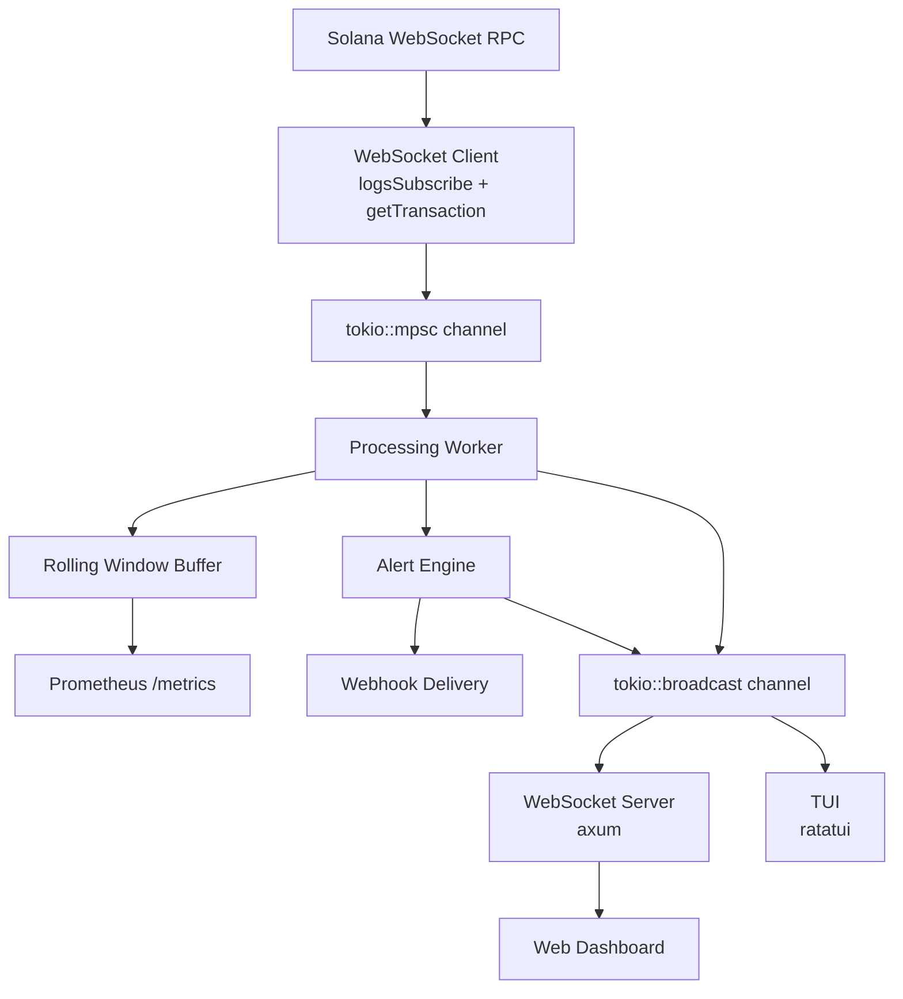

# GulfWatch

Real-time security monitoring and alerting for Solana programs. Streams live transaction data from the chain, detects exploit patterns, fires alerts, and presents everything through a terminal TUI and REST API.

Protocol teams find out they've been hacked from Twitter. GulfWatch tells them first.

## The Problem

Solana has seen massive protocol exploits -- Wormhole ($320M), Mango Markets ($114M), Crema ($8.8M). Every one of them had visible on-chain footprints before the damage was done. But there's no real-time security monitoring product for Solana programs. Teams either build janky custom scripts on webhooks or find out something's wrong from crypto Twitter.

## What It Does

- Streams live transactions for any Solana program via WebSocket RPC
- **Runs three security detections** on every transaction:
  - **Authority Change**: fires on SPL Token `SetAuthority` or BPF Loader `Upgrade` (the loudest red flags in the Solana exploit playbook)
  - **Failed Transaction Cluster**: fires when a signer produces a burst of failures followed by a success (the classic attacker-probe-then-land pattern that preceded Wormhole, Mango, and several Curve exploits)
  - **Large Transfer Anomaly**: fires when a token transfer above a configurable threshold leaves a watched vault account (the "drain in progress" signal)
- Computes rolling window metrics (error rate, tx volume, compute units, instruction breakdown)
- Fires configurable threshold alerts on those metrics (error rate spikes, tx volume anomalies)
- Delivers alerts via WebSocket, TUI, and per-rule webhooks (Slack, Discord, anything that accepts a JSON POST)
- Exports Prometheus-compatible metrics for Grafana integration

For the deep-dive on how each detection works, what it doesn't catch, and how to add a fourth: see [`docs/detections.md`](docs/detections.md).

## Structure

```
crates/
  gulfwatch-core/       # shared types, rolling window, metrics, alerts, pipeline
  gulfwatch-ingest/     # Solana WebSocket RPC client, transaction parsing
  gulfwatch-server/     # axum REST API + WebSocket + Prometheus (binary)
  gulfwatch-tui/        # terminal dashboard (binary, standalone)
web/                    # Next.js dashboard (frontend)
```

## Setup

```bash
git clone https://github.com/meowyx/gulfwatch.git
cd gulfwatch
```

Create a `.env` file in the project root:

```
SOLANA_WS_URL=wss://api.devnet.solana.com
SOLANA_RPC_URL=https://api.devnet.solana.com
MONITOR_PROGRAM=TokenkegQfeZyiNwAJbNbGKPFXCWuBvf9Ss623VQ5DA
```

Or with a Helius API key for better rate limits:

```
SOLANA_WS_URL=wss://devnet.helius-rpc.com/?api-key=YOUR_KEY
SOLANA_RPC_URL=https://devnet.helius-rpc.com/?api-key=YOUR_KEY
MONITOR_PROGRAM=TokenkegQfeZyiNwAJbNbGKPFXCWuBvf9Ss623VQ5DA
```

To arm the **large-transfer detection**, add the watched accounts and a threshold (in raw token units, for SOL with 9 decimals, `10000000000` is 10 SOL; for USDC with 6 decimals, `10000000000` is 10,000 USDC):

```
WATCHED_ACCOUNTS=DQyrAcCrDXQ7NeoqGgDCZwBvWDcYmFCjSb1JtteuC5BZ,HLmqeL62xR1QoZ1HKKbXRrdN1p3phKpxRMb2VVopvBBz
LARGE_TRANSFER_THRESHOLD=10000000000
```

Without these two vars, the large-transfer detection is silently inert. The other two security detections (authority change and failed-tx cluster) need no configuration and run by default.

## Running

### TUI (terminal dashboard)

Self-contained -- connects directly to Solana, no server needed.

```bash
cargo run -p gulfwatch-tui
```

**Keybindings:**

| Key | Action |
|---|---|
| `Tab` / `Shift-Tab` | Switch panels |
| `1` `2` `3` | Jump to panel |
| `j`/`k` or `Up`/`Down` | Scroll / move selection |
| `Enter` | Open detail view |
| `Esc` / `Backspace` | Back to dashboard |
| `q` / `Ctrl-C` | Quit |

### Server (REST API + WebSocket)

For the web dashboard frontend. Optionally set `LISTEN_ADDR` (defaults to `0.0.0.0:3001`).

```bash
cargo run -p gulfwatch-server
```

The server supports comma-separated programs via `MONITOR_PROGRAMS`:

```
MONITOR_PROGRAMS=675kPX9MHTjS2zt1qfr1NYHuzeLXfQM9H24wFSUt1Mp8,JUP6LkMUjV1hTVo8YS7ZMCwnvzKmqPuqZoFkMjEHpKu
```

### Tests

```bash
cargo test --workspace
```

## API

### REST

```
GET  /health
GET  /api/programs
POST /api/programs                  { "program_id": "..." }
DELETE /api/programs/{id}
GET  /api/metrics/summary           ?program=...
GET  /api/metrics/timeseries        ?program=...&interval=60
GET  /api/transactions/recent       ?program=...&limit=50
GET  /api/alerts
POST /api/alerts                    { AlertRule JSON }
PUT  /api/alerts/{id}
DELETE /api/alerts/{id}
GET  /metrics                       Prometheus format
```

### WebSocket

```
WS /ws/feed

Client sends:    { "subscribe": ["program_id"] }
                 { "unsubscribe": ["program_id"] }

Server sends:    { "type": "transaction", "data": { ... } }
                 { "type": "alert", "data": { ... } }
```

## Architecture



For the full crate-by-crate breakdown, the in-memory state model, and why there's no database: see [`docs/architecture.md`](docs/architecture.md).

## Environment Variables

| Variable | Required | Description |
|---|---|---|
| `SOLANA_WS_URL` | Yes | Solana WebSocket RPC endpoint |
| `SOLANA_RPC_URL` | Yes | Solana HTTP RPC endpoint |
| `MONITOR_PROGRAM` | Yes | Program ID to monitor |
| `MONITOR_PROGRAMS` | No | Comma-separated program IDs (server only) |
| `LISTEN_ADDR` | No | Server listen address (default: `0.0.0.0:3001`) |
| `WATCHED_ACCOUNTS` | No | Comma-separated SPL token account addresses to watch for large outbound transfers. Empty → large-transfer detection is inert. |
| `LARGE_TRANSFER_THRESHOLD` | No | Minimum transfer amount in raw token units (smallest denomination) that fires the large-transfer alert. Unset → detection is inert. |

## Documentation

Deep-dive docs live in [`docs/`](docs/). Start with [`docs/README.md`](docs/README.md) for the index.

| Doc | Read it when |
|---|---|
| [`docs/architecture.md`](docs/architecture.md) | You want a mental model of the whole system before touching code |
| [`docs/classification.md`](docs/classification.md) | You're debugging the parser, adding support for a new program, or trying to understand what the detections actually see |
| [`docs/detections.md`](docs/detections.md) | You're rendering alerts in a UI, evaluating detection coverage, or planning a new detection rule |

