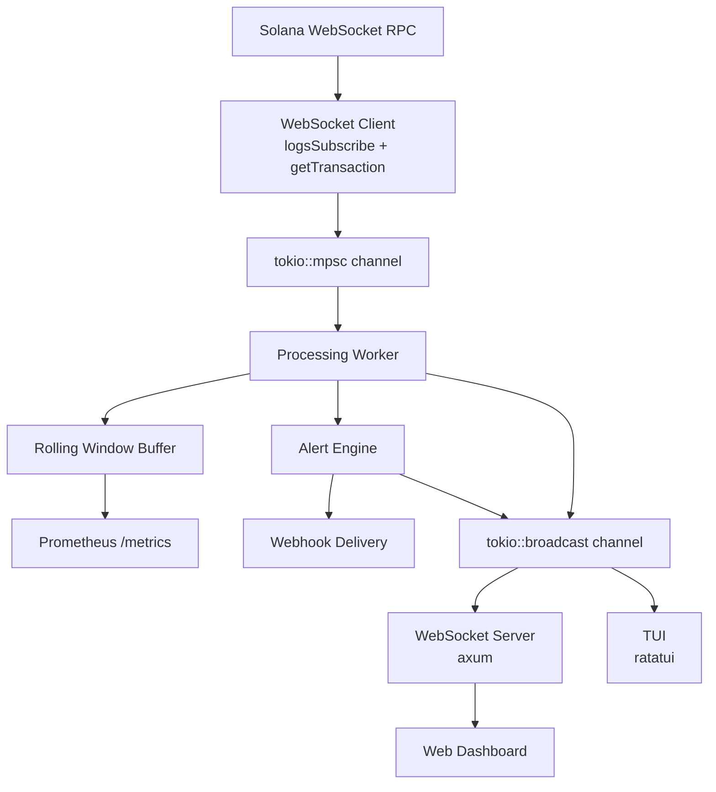

<div align="center">

# GulfWatch

### The runtime intelligence layer for Solana

Monitor live program behavior, inspect transactions deeply, profile runtime performance, and detect suspicious activity in one product.

[](https://www.rust-lang.org/)
[](https://solana.com/)
[]()
[]()
[](https://www.colosseum.org/)

**Observe → Inspect → Understand → Act**

</div>

---

GulfWatch helps developers and protocol teams understand what their programs are doing in production. Instead of using one tool to notice an issue and another tool to understand it, you do both here.

## 🚀 Quickstart

```bash
git clone https://github.com/meowyx/gulfwatch.git
cd gulfwatch
cp .env.example .env        # then fill in SOLANA_WS_URL, SOLANA_RPC_URL, MONITOR_PROGRAMS
cargo run -p gulfwatch-tui  # standalone TUI, no server needed
```

Once the TUI starts running, then live transactions start streaming into the Programs sidebar. Press arrow keys to filter to a monitored program, `Tab` to cycle panels, `Enter` on a transaction for the detail view.

## 🧭 The Problem

The missing layer in Solana is not data access. It's **runtime understanding**.

**Developers** struggle to debug production transactions, failed txs, runaway compute, unexpected behavior across RPC responses, logs, and one-off scripts.

**Protocol teams** struggle to detect suspicious behavior early. Wormhole ($320M), Mango Markets ($114M), and Crema ($8.8M) all had visible on-chain footprints before the damage was done, but the signal was hard to catch in real time.

GulfWatch closes the gap.

## ✨ What It Does


**TL;DR**

- **For developers** : live transaction feed, decoded instructions (System, SPL Token, **Token 2022** including extensions, ATA, Compute Budget, BPF Loader, more), per-instruction compute unit profiling, transaction deep-dives, account and balance state diffs, failed-transaction analysis, and replay and debugging workflows.
- **For protocol teams** : real-time multi-program monitoring, **seven security detection rules** running today (authority changes, probing patterns, abnormal transfers, Token 2022 extensions), threshold alert rules with per-rule webhook delivery, multi-program suspicious correlation, and an interactive alert rule editor with live-eval preview.
- **Shared platform** : Programs sidebar in the TUI, rolling window metrics, Prometheus `/metrics` endpoint, zero database, runs as a single Rust binary against any Solana RPC endpoint.

<details>
<summary><b>Show the full feature breakdown (shipped vs. roadmap)</b></summary>

Legend: ✓ shipped, ◐ partial, ○ roadmap.

### Runtime investigation (for developers)

- ✓ **Live transaction feed** across one or many Solana programs via WebSocket RPC
- ✓ **Decoded instructions** for System, SPL Token, Token 2022 (including extension instructions), Associated Token Account, Memo, Compute Budget, BPF Loader, Stake, plus prefix-matched coverage for Raydium and Jupiter
- ✓ **Per-instruction compute unit profiling** reconstructed from `getTransaction` log messages, no extra RPC calls, no custom node
- ✓ **Log inspection** — full transaction logs surface in the TUI detail view alongside the CU profile
- ◐ **Transaction deep-dives** — detail view with decoded instructions and account list ships today; the fuller tabbed deep-dive with account state diff and failed-tx mode lands in Phase 2.5 Feature C (Apr 17-22)
- ○ **Account and balance diffs** — structured diff of `preBalances` / `postBalances` / `preTokenBalances` / `postTokenBalances`. Phase 2.5 Feature C, Apr 19-20
- ○ **Failed transaction analysis** — parsed `InstructionError` with the failing instruction highlighted, error code translated to the Anchor IDL error name. Phase 2.5 Feature C, Apr 21-22
- ○ **Replay and debugging workflows** — replay any transaction from the rolling window against the current detection rules to see which would have fired. Phase 4 Tier S, Apr 28 – May 3

### Runtime detection (for protocol teams)

Seven detection rules running on every transaction today:

| Detection | Triggers on | Signal |
|---|---|---|
| **Authority Change** | SPL Token `SetAuthority` or BPF Loader `Upgrade` | Loudest red flag in the exploit playbook |
| **Failed Tx Cluster** | Signer produces a burst of failures then lands a success | Probe-then-land pattern that preceded Wormhole, Mango, and several Curve exploits |
| **Large Transfer Anomaly** | Token transfer above a configurable threshold leaving a watched vault | "Drain in progress" |
| **Transfer Hook Upgrade** | Token 2022 `InitializeTransferHook`, `UpdateTransferHook`, or `SetAuthority(TransferHookProgramId)` | Mint just got a custom transfer-time program attached |
| **Permanent Delegate** | Token 2022 `InitializePermanentDelegate` or `SetAuthority(PermanentDelegate)` | A mint now has a silent-move authority over user balances |
| **Transfer Fee Authority Change** | Token 2022 `SetAuthority(TransferFeeConfig)` | Control of the mint's fee lever changed hands |
| **Default Account State Frozen** | Token 2022 default account state flipped to Frozen | New accounts on this mint start frozen by default |

Plus, across shipped and roadmap:

- ✓ **Real-time monitoring** : live WebSocket RPC stream with multi-program support and the Programs sidebar filter
- ✓ **Threshold alert rules** : REST CRUD on `/api/alerts` with per-rule webhook delivery and 30s dedup cooldown, fires against rolling window metrics (error rate, tx count, CU averages)
- ◐ **Alert-to-investigation handoff** : webhooks + WebSocket broadcast + TUI alerts panel ship today; click-through from a fired alert to the transaction deep-dive lands with Phase 2.5 Feature C
- ○ **Multi-program suspicious correlation** : cross-program signer tracker that fires when one wallet touches multiple monitored programs in suspicious patterns within a short window. Phase 2.5 Feature B, Apr 19 progress checkpoint
- ○ **Alert rule editor with live-eval preview** : interactive in-TUI rule authoring with a preview pane showing which recent txs would have triggered. Phase 4 Tier A, ships in the May 1-4 slot if there's room

### Shared platform

- ✓ **Multi-program monitoring** : watch Raydium, Jupiter, Token 2022, and your own programs in parallel with a single config
- ✓ **Programs sidebar in the TUI** : live per-program tx counts, alert flags, and keyboard filtering across Transactions / Metrics / Alerts panels
- ✓ **Rolling window metrics** (error rate, tx volume, compute units, instruction breakdown) computed per program
- ✓ **Prometheus-compatible `/metrics` endpoint** for Grafana integration
- ✓ **Zero database** : everything runs in memory against a rolling window, so the server is a single binary with no external dependencies beyond an RPC endpoint

For the deep-dive on how each detection works, what it doesn't catch, and how to add a new one: see [`docs/detections.md`](docs/detections.md).

</details>

## 📦 Structure

```
crates/
  gulfwatch-classification/  # transaction semantic classifiers + debug trace
  gulfwatch-core/       # shared types, rolling window, metrics, alerts, pipeline
  gulfwatch-ingest/     # Solana WebSocket RPC client, transaction parsing
  gulfwatch-server/     # axum REST API + WebSocket + Prometheus (binary)
  gulfwatch-tui/        # terminal dashboard (binary, standalone)
web/                    # Next.js dashboard (frontend)
```

## ⚙️ Setup


<details>
<summary>Large-transfer detection setup</summary>

To arm the **large-transfer detection**, add the watched accounts and a threshold (in raw token units, for SOL with 9 decimals, `10000000000` is 10 SOL; for USDC with 6 decimals, `10000000000` is 10,000 USDC):

```
WATCHED_ACCOUNTS=DQyrAcCrDXQ7NeoqGgDCZwBvWDcYmFCjSb1JtteuC5BZ,HLmqeL62xR1QoZ1HKKbXRrdN1p3phKpxRMb2VVopvBBz
LARGE_TRANSFER_THRESHOLD=10000000000
```

Without these two vars, the large-transfer detection is silently inert. The other two security detections (authority change and failed-tx cluster) need no configuration and run by default.

</details>

## ▶️ Running

<details>
<summary>Show running commands and keybindings</summary>

### TUI (terminal dashboard)

Self-contained : connects directly to Solana, no server needed. Supports multi-program monitoring via `MONITOR_PROGRAMS` (comma-separated) in `.env`.

```bash
cargo run -p gulfwatch-tui
```

**Layout:** four panels - **Programs** (left sidebar with per-program tx counts and alert flags), **Transactions**, **Metrics**, **Alerts**.

**Keybindings:**

| Key | Action |
|---|---|
| `Tab` / `Shift-Tab` | Cycle through all four panels |
| `1`–`9` | Filter Transactions / Metrics / Alerts to program _N_ |
| `a` | Clear filter, return to "All" merged view |
| `j`/`k` or `Up`/`Down` | Scroll / move selection (scrolls Metrics when focused) |
| `Enter` | Open detail view (or commit sidebar selection as the filter) |
| `Esc` / `Backspace` | Back to dashboard |
| `q` / `Ctrl-C` | Quit |

## 🔧 Environment Variables

| Variable | Required | Description |
|---|---|---|
| `SOLANA_WS_URL` | Yes | Solana WebSocket RPC endpoint |
| `SOLANA_RPC_URL` | Yes | Solana HTTP RPC endpoint |
| `MONITOR_PROGRAMS` | Yes\* | Comma-separated program IDs to monitor. Recommended form. Works in both server and TUI. |
| `MONITOR_PROGRAM` | Yes\* | Single program ID fallback. Accepted when `MONITOR_PROGRAMS` is not set, kept for backward compatibility. |
| `LISTEN_ADDR` | No | Server listen address (default: `0.0.0.0:3001`) |
| `WATCHED_ACCOUNTS` | No | Comma-separated SPL token account addresses to watch for large outbound transfers. Empty → large-transfer detection is inert. |
| `LARGE_TRANSFER_THRESHOLD` | No | Minimum transfer amount in raw token units (smallest denomination) that fires the large-transfer alert. Unset → detection is inert. |
| `ROLLING_WINDOW_MINUTES` | No | Rolling window size for metrics and detection (default: `10`). |

\* At least one of `MONITOR_PROGRAMS` or `MONITOR_PROGRAM` must be set.

### Server (REST API + WebSocket)

For the web dashboard frontend. Optionally set `LISTEN_ADDR` (defaults to `0.0.0.0:3001`).

```bash
cargo run -p gulfwatch-server
```

The server supports comma-separated programs via `MONITOR_PROGRAMS`:

```
MONITOR_PROGRAMS=675kPX9MHTjS2zt1qfr1NYHuzeLXfQM9H24wFSUt1Mp8,JUP6LkMUjV1hTVo8YS7ZMCwnvzKmqPuqZoFkMjEHpKu
```

### Tests

```bash
cargo test --workspace
```

</details>

## 🔌 API

<details>
<summary>Show REST and WebSocket API</summary>

### REST

```
GET  /health
GET  /api/programs
POST /api/programs                  { "program_id": "..." }
DELETE /api/programs/{id}
GET  /api/metrics/summary           ?program=...
GET  /api/metrics/timeseries        ?program=...&interval=60
GET  /api/transactions/recent       ?program=...&limit=50&category=...&classifier=...&min_confidence=...&has_debug=true
GET  /api/alerts
POST /api/alerts                    { AlertRule JSON }
PUT  /api/alerts/{id}
DELETE /api/alerts/{id}
GET  /metrics                       Prometheus format
```

### WebSocket

```
WS /ws/feed

Client sends:    { "subscribe": ["program_id"] }
                 { "unsubscribe": ["program_id"] }

Server sends:    { "type": "transaction", "data": { ... } }
                 { "type": "alert", "data": { ... } }
```

</details>

## 🏗️ Architecture



For the full crate-by-crate breakdown, the in-memory state model, and why there's no database: see [`docs/architecture.md`](docs/architecture.md).


## 📚 Documentation

Deep-dive docs live in [`docs/`](docs/). Start with [`docs/README.md`](docs/README.md) for the index.

| Doc | Read it when |
|---|---|
| [`docs/architecture.md`](docs/architecture.md) | You want a mental model of the whole system before touching code |
| [`docs/classification.md`](docs/classification.md) | You're debugging the parser, adding support for a new program, or trying to understand what the detections actually see |
| [`docs/transaction-classification.md`](docs/transaction-classification.md) | You're debugging why a tx is labeled `swap` / `fallback`, tuning classifier behavior, or adding a classifier |
| [`docs/detections.md`](docs/detections.md) | You're rendering alerts in a UI, evaluating detection coverage, or planning a new detection rule |

## 📄 License

License TBD — will be finalized pre-submission. Likely MIT or Apache-2.0.

---

<div align="center">

**Shipped with 🦀 Rust, [Tokio](https://tokio.rs/), [Ratatui](https://ratatui.rs/), and [Axum](https://github.com/tokio-rs/axum).**

_Solana teams do not need more raw data. They need understanding._

</div>
