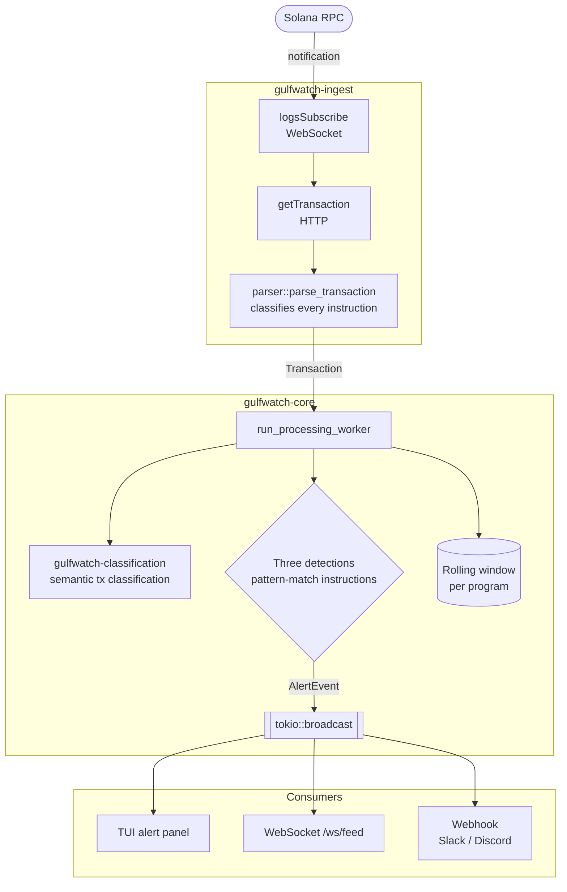

# Architecture

> **TL;DR:** GulfWatch streams live Solana transactions for any program you point it at, decodes every instruction inside them, classifies the full transaction semantics (`swap`, `bridge_out`, `nft_send`, etc.), and runs security detections that fire alerts when something looks like an exploit in progress. All in-memory, single binary per role, no database, sub-second latency from on-chain event to alert.

## The problem this solves

Solana protocols lose hundreds of millions of dollars to exploits every year: Wormhole ($320M), Mango Markets ($114M), Crema ($8.8M). Every one of these had a visible on-chain footprint *before* the actual drain happened: an authority change here, a burst of failed probing transactions there, then the final draining transfer. Protocol teams almost always learn about it from Twitter, minutes too late.

Mature security monitoring exists for Ethereum (Forta, OpenZeppelin Defender). For Solana there's a gap: teams either build janky webhook scripts themselves, or they wait for the explosion. **GulfWatch fills that gap.** It watches monitored programs in real time, classifies every instruction inside every transaction, and fires alerts the second a known-bad pattern shows up.

The pitch in one line: *"Know before Twitter knows."*

## The flow in one picture



If you only read one thing in this doc, read the diagram. Everything else is detail. For the per-instruction classification logic inside the parser, see [`classification.md`](classification.md); it has its own diagram drawn at the right level of detail.

## The five crates

GulfWatch is a Cargo workspace with five crates. Each one has a single sharp responsibility — when something breaks, you know which crate to open.

### `gulfwatch-classification`: transaction type engine

Lives at `crates/gulfwatch-classification/`. Converts parsed instructions into high-level transaction categories (for example `defi_swap`, `bridge_out`, `nft_send`, `stake_withdraw`) and emits an explainable debug trace (classifier decisions + derived transfer legs).

| Module | What it does |
|---|---|
| `lib.rs` | Classifier chain, derived feature/leg builder, and classification output model. |
| `program_ids/` | Local program-ID registry used by classifier heuristics (bridge, privacy, nft, stake, memo, dex hints). |

**Why this is a separate crate:** it keeps transaction semantics and classifier evolution independent from ingest transport and from detection logic.

### `gulfwatch-core`: the orchestration brain

Lives at `crates/gulfwatch-core/`. Contains every type and every algorithm that doesn't touch the network. Pure data-in / data-out.

| Module | What it does |
|---|---|
| `transaction.rs` | The `Transaction`, `ParsedInstruction`, and `InstructionKind` types. The data model for a parsed Solana transaction. |
| `pipeline.rs` | `AppState` (shared state for all consumers), `WorkerHandle`, and `run_processing_worker` — the loop that enriches tx classification, runs detections, and broadcasts events. |
| `rolling_window.rs` | Per-program ring buffer of recent transactions, used for time-bucketed metric aggregation. |
| `metrics.rs` | The `MetricSummary` shape returned by the REST API. |
| `alert.rs` | `AlertRule`, `AlertEvent`, and the threshold-based `AlertEngine` (separate from the detection trait, it handles classic metric-based alerts like "error rate > 10%"). |
| `detections/` | The three Phase 1 security detections (`authority_change`, `failed_tx_cluster`, `large_transfer`) plus the `Detection` trait they all implement. |

**Why this is a separate crate:** the core has zero I/O. No HTTP, no WebSocket, no Solana RPC. Every test in `gulfwatch-core` runs in milliseconds with no network.

### `gulfwatch-ingest`: the eyes

Lives at `crates/gulfwatch-ingest/`. The Solana data adapter. Subscribes to Solana over WebSocket, fetches full transaction details over HTTP, and pushes parsed `Transaction` objects into an mpsc channel that the core's worker drains.

| Module | What it does |
|---|---|
| `client.rs` | `SolanaIngestClient` — opens the WebSocket, calls `logsSubscribe`, fetches transactions via `getTransaction`, handles reconnect with exponential backoff. |
| `parser.rs` | The classification engine. Turns raw `getTransaction` JSON into the typed `Transaction` from `gulfwatch-core`. **This is where every "what is this instruction?" decision happens.** See [`classification.md`](classification.md) for the deep dive. |

**Why ingest is separate from core:** the only thing tied to a Solana RPC URL lives in this crate. If we ever want to swap WebSocket RPC for Yellowstone gRPC, or add a "replay from a JSON dump" mode for offline testing, we change *this* crate and nothing downstream notices.

### `gulfwatch-server`: the front door for the web dashboard

Lives at `crates/gulfwatch-server/`. An axum HTTP + WebSocket server. Wires `gulfwatch-ingest` and `gulfwatch-core` together, exposes a REST API + a WebSocket feed + a Prometheus `/metrics` endpoint, and is what the Next.js frontend in `web/` talks to.

Run with:

```bash
cargo run -p gulfwatch-server
```

The REST + WebSocket API contract lives in the [root README](../README.md#api).

### `gulfwatch-tui`: the standalone terminal dashboard

Lives at `crates/gulfwatch-tui/`. A Ratatui terminal app. **Standalone**: runs its own ingest pipeline, doesn't need the server, doesn't talk to the server. Perfect for live demos and for monitoring a program from a single command on a laptop.

Run with:

```bash
cargo run -p gulfwatch
```

The TUI and the server share `gulfwatch-core` and `gulfwatch-ingest` as library dependencies, so they can never drift in their understanding of "what is a transaction" or "what does Authority Change detection do."

## The data flow in plain steps

If diagrams aren't your thing, here's the same story in five sentences:

1. **Subscribe.** GulfWatch opens a WebSocket connection to a Solana RPC endpoint and subscribes to logs mentioning the monitored program (e.g. Raydium AMM v4). The subscription stays open for the life of the process.
2. **Fetch.** When Solana sends a notification ("transaction X mentioned your program"), we immediately call `getTransaction` over HTTP to fetch the full transaction details, accounts, instructions, success/failure, fees, compute units.
3. **Parse.** The parser walks every instruction in the transaction, **both top-level and inner CPIs**, and classifies each one into a typed enum (`SetAuthority`, `TokenTransfer { amount }`, `Other { name }`, etc.). The output is a `Transaction` struct with a `Vec<ParsedInstruction>` ready for inspection.
4. **Classify transaction semantics.** The worker runs `gulfwatch-classification` to assign a high-level tx type and debug trace.
5. **Detect.** The processing worker runs each registered `Detection` against the parsed transaction. Each detection is a small struct that pattern-matches on the instruction list and returns `Option<AlertEvent>`.
6. **Broadcast.** Anything a detection returns gets pushed onto a `tokio::broadcast` channel. Every connected consumer (TUI alert panel, WebSocket clients, webhook delivery task) sees it within milliseconds. The transaction itself also gets pushed into a rolling window for metric aggregation.

## Key design decisions and why

The choices below aren't obvious from reading the code. They're worth knowing because they shape what GulfWatch is and isn't good at.

### No database. All state lives in memory.

Real-time security monitoring cares about "what's happening in the last 5–15 minutes," not "query historical data from March." We keep a rolling in-memory window of recent transactions and compute every metric from that buffer. When the process restarts, it picks up fresh from the live stream.

The win: **GulfWatch is a single binary with no external dependencies besides a Solana RPC endpoint.** Zero ops surface. No database to back up, no schema migrations, no "the storage layer is down" outage mode. The transaction data itself lives on-chain — we don't need to duplicate it.

### Typed enums in core, parsing at the edge.

Detection rules should be *pattern matches*, not byte parsers. By the time a `Transaction` reaches a detection, every instruction is already classified into an `InstructionKind` enum. Authority change detection is literally:

```rust
match ix.kind {
    InstructionKind::SetAuthority | InstructionKind::Upgrade => fire(),
    _ => continue,
}
```

The total Rust code for all three Phase 1 detections is under 200 lines because none of them have to decode bytes — that work happens once, in the parser, at the edge of the system. Add a fourth detection? Three lines plus a registration call.

### Two binaries, not one.

The server runs as a service behind the Next.js dashboard, typically one instance per protocol team. The TUI runs locally on a developer's laptop and is self-contained: no server, no setup, just `cargo run -p gulfwatch`. Both binaries share the same core and ingest crates, so they can't drift in their detection logic or their understanding of a transaction. Different deployment models, identical brain.

### Ingest is its own crate so the core has zero I/O.

If you want to add a "replay from a JSON dump" mode for offline testing, or swap WebSocket RPC for Yellowstone gRPC, you change `gulfwatch-ingest` and the rest of the system doesn't move. The core's tests don't need a network, don't need a Solana account, don't need anything but the test data they construct themselves.

### Detections are a trait, not hardcoded rules.

Adding a fourth detection should be one new file plus one line in `main.rs`. Each detection implements `Detection` and gets registered into a `Vec<Box<dyn Detection>>` at startup:

```rust
let detections: Vec<Box<dyn Detection>> = vec![
    Box::new(AuthorityChangeDetection),
    Box::new(FailedTxClusterDetection::default()),
    Box::new(LargeTransferDetection::new(watched_accounts, threshold)),
];
```

The processing worker loops through them on every transaction without knowing which is which. The trait definition is in `crates/gulfwatch-core/src/detections/mod.rs` and is intentionally minimal: just `name()` and `evaluate(&mut self, &Transaction) -> Option<AlertEvent>`.

## What GulfWatch deliberately does not do (yet)

Honest list. These are not bugs — they're scope choices for Phase 1.

- **No persistence.** All state lives in memory. Restart = fresh window. Historical baselines come post-hackathon.
- **No mainnet hardening for sustained high volume.** Tested against devnet and a single mainnet program (Raydium AMM v4). Phase 2 stress-tests against mainnet's actual throughput and tunes channel bounds + window size.
- **No multi-tenant config.** One process watches one set of programs configured at startup. To watch a different protocol, restart with new env vars.
- **No auto-tuned thresholds.** Detection thresholds are static, set by the operator in `.env`. Adapting them to historical norms is post-hackathon.
- **No oracle / flash-loan / CPI-anomaly detection.** Three rules in Phase 1; the rest are on the roadmap.

## Where to read next

- **[`classification.md`](classification.md)** — how a raw Solana transaction becomes a typed `ParsedInstruction`.
- **[`transaction-classification.md`](transaction-classification.md)** — how typed instructions become high-level tx categories and debug traces.
- **[`detections.md`](detections.md)** — the three Phase 1 security rules: what they fire on, why they matter, and how to configure them.
- **[Root `README.md`](../README.md)** — install instructions, environment variables, and the REST + WebSocket API contract that the frontend talks to.
