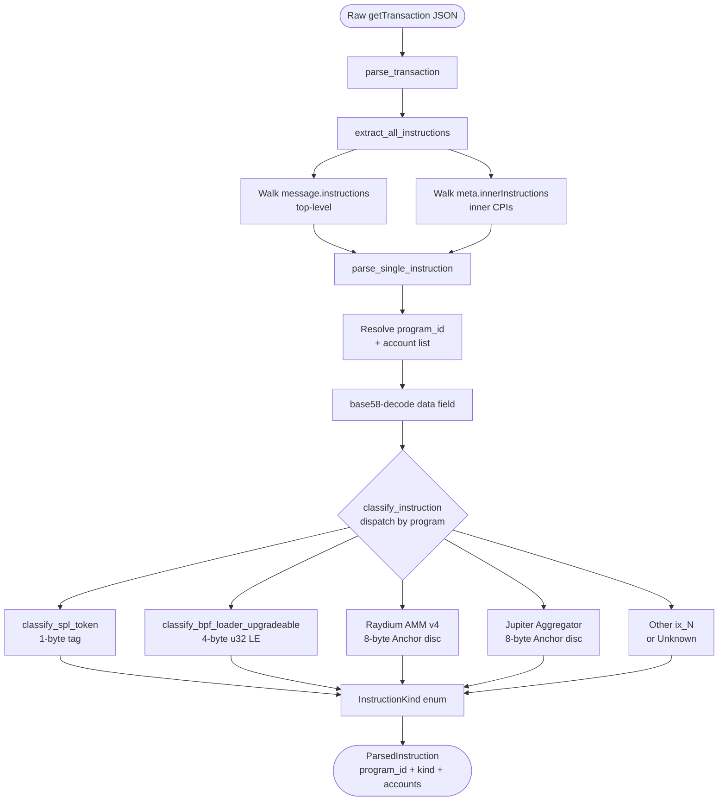

# Classification

How GulfWatch turns a raw Solana transaction into something a security detection can pattern-match on.

If you remember one sentence: **the parser labels every instruction inside a transaction with a typed enum, and the detections never see raw bytes.**

## The mental model

Think of it like sorting mail.

Solana hands GulfWatch a transaction, an envelope with a stack of items inside. Each item is called an **instruction**: a single atomic operation like *"transfer 100 USDC from account X to account Y"* or *"change the authority on this token mint."* A single transaction usually contains 4–10 instructions stacked together; a Raydium swap, for example, contains the swap call itself plus the inner Token Program transfers it triggers.

The **parser**'s job is to open the envelope and stick a label on every item:

- *"this is a token transfer of 100 USDC from vault X to wallet Y"*
- *"this is a swap on Raydium"*
- *"this is someone changing the authority on a mint"*

Once everything is labeled, the **detections** read the labels and decide whether anything looks bad. They never deal with the raw envelope contents themselves — that's the parser's job.

That separation is the whole architecture. Add a new detection? You write a function that pattern-matches on labels. Add a new program we want to understand? You teach the parser one new label format. Neither side has to know about the other.

## The flow inside the parser

Here's what happens between "raw JSON arrives" and "labeled `Vec<ParsedInstruction>` comes out":



The whole thing lives in `crates/gulfwatch-ingest/src/parser.rs`. Two functions matter most:

- **`extract_all_instructions`** — walks both the top-level instructions AND the inner instructions (CPIs) and returns a flat list. This is the function that makes Feature 3 (large transfer detection) work against Raydium swaps, because the actual token movements are *inside* the swap call as inner instructions.
- **`classify_instruction`** — the dispatch table. Takes `(program_id, raw_bytes)` and returns an `InstructionKind`. This is the function that knows how to read SPL Token tags, BPF Loader discriminators, and Anchor discriminators.

## The label types: `InstructionKind`

Every classified instruction becomes one of these variants. Defined in `crates/gulfwatch-core/src/transaction.rs`:

```rust
pub enum InstructionKind {
    SetAuthority,
    Upgrade,
    TokenTransfer { amount: u64 },
    TokenTransferChecked { amount: u64, decimals: u8 },
    Other { name: String },
    Unknown,
}
```

| Variant | What it represents | Pre-decoded fields |
|---|---|---|
| `SetAuthority` | SPL Token Program SetAuthority (tag 6). Changes mint authority, freeze authority, or token account owner. | None, the existence of the instruction is the signal. |
| `Upgrade` | BPF Loader Upgradeable Upgrade (u32 LE = 3). Replaces a program's bytecode. | None. |
| `TokenTransfer { amount }` | SPL Token Program Transfer (tag 3). Moves tokens from a source account. | The amount, in raw token units. |
| `TokenTransferChecked { amount, decimals }` | SPL Token Program TransferChecked (tag 12). Same as Transfer but with explicit decimals for type-safety. | The amount AND the decimals declared by the instruction. |
| `Other { name }` | A classified-but-not-pre-decoded instruction. The string is a human name like `"swap"`, `"route"`, or `"addLiquidity"`. | Just the name. |
| `Unknown` | An instruction we couldn't decode at all (empty data, or no rules matched). | None. |

The key idea: **whatever data a detection needs is already extracted into the variant**. `LargeTransferDetection` doesn't have to decode bytes to find the transfer amount — it pattern-matches on `TokenTransfer { amount }` and the field is right there.

## The dispatch table: what we recognize per program

The reason classification has to dispatch by program is that **different programs encode "which instruction is this" differently**. Three formats matter:

| Program type | How instructions are tagged | Example | Handled in |
|---|---|---|---|
| **Native programs** (SPL Token, System Program) | Single byte at the start of `data` | SPL Token Transfer = byte `3` | `classify_spl_token` |
| **BPF Loader Upgradeable** | First 4 bytes interpreted as u32 little-endian | Upgrade = `[3, 0, 0, 0]` | `classify_bpf_loader_upgradeable` |
| **Anchor programs** (Raydium, Jupiter, most modern protocols) | First 8 bytes, a hash of `"global:<method_name>"` truncated to 8 bytes | Jupiter `route` = `[229, 23, 203, 151, 122, 227, 173, 42]` | per-program branches inside `classify_instruction` |

**Critical detail:** the same byte sequence means *different things* on different programs. `[3, 0, 0, 0, ...]` means `addLiquidity` on Raydium and `Transfer` on the Token Program. Classification is **always** `(program_id, bytes) → kind`, never `bytes → kind` alone. That's why the dispatch step exists.

## SPL Token instruction layouts

The most important program we decode is the SPL Token Program (`TokenkegQfeZyiNwAJbNbGKPFXCWuBvf9Ss623VQ5DA`). Three instructions matter for Phase 1 detections:

| Instruction | Tag | Layout (bytes) | What we extract |
|---|---|---|---|
| **Transfer** | 3 | `tag(1) \| amount(8 LE u64)` | `amount` |
| **SetAuthority** | 6 | `tag(1) \| authority_type(1) \| option<new_authority>` | (existence only) |
| **TransferChecked** | 12 | `tag(1) \| amount(8 LE u64) \| decimals(1)` | `amount`, `decimals` |

Why we picked these three: Transfer + TransferChecked together cover **every** token movement on Solana, which is what `LargeTransferDetection` needs. SetAuthority is one half of the Authority Change detection (the other half is the BPF Loader Upgrade). That's it for Phase 1 — we'll add more (Burn, MintTo, etc.) when future detections need them.

The actual decoding lives in `classify_spl_token`:

```rust
fn classify_spl_token(data: &[u8]) -> InstructionKind {
    match data[0] {
        3 if data.len() >= 9 => {
            let amount = u64::from_le_bytes(data[1..9].try_into().unwrap_or([0; 8]));
            InstructionKind::TokenTransfer { amount }
        }
        6 => InstructionKind::SetAuthority,
        12 if data.len() >= 10 => {
            let amount = u64::from_le_bytes(data[1..9].try_into().unwrap_or([0; 8]));
            let decimals = data[9];
            InstructionKind::TokenTransferChecked { amount, decimals }
        }
        tag => InstructionKind::Other {
            name: format!("token_ix_{}", tag),
        },
    }
}
```

Three things to notice:

1. **Defensive length checks**: if a malformed instruction has fewer bytes than the layout requires, we fall through to `Other` rather than panicking.
2. **Little-endian u64**: Solana is consistent about LE for amounts. `from_le_bytes` is the right reader.
3. **The fallthrough is `Other { name: "token_ix_<tag>" }`**: unknown SPL Token tags are still labeled, so detections can see "something happened on the Token Program" without us teaching the parser every instruction up front.

## Inner instructions are where the action is

This is the single most important thing about Solana classification, and the one most newcomers miss.

When a user calls Raydium's `swap` instruction at the top level, that **single top-level instruction** triggers the Raydium program to internally call the SPL Token Program's `Transfer` instruction *twice*:

1. Take the user's input token from their wallet → push to Raydium's vault
2. Take the output token from Raydium's vault → push to the user's wallet

These internal calls are called **CPIs** (Cross-Program Invocations) and they show up in the `meta.innerInstructions` array of the transaction, **not** in `message.instructions`.

If we only looked at top-level instructions, we'd see "this was a Raydium swap" and miss every actual token movement. By walking inner instructions too, we see *both*: "this swap involved a TokenTransfer of 1,500 USDC out of vault X." That's why `LargeTransferDetection` works against Raydium swaps even though Raydium swaps don't *look* like transfers at the top level.

`extract_all_instructions` walks both arrays in order, top-level first, then inner instructions in the order `getTransaction` emits them, and returns a flat `Vec<ParsedInstruction>`. The detections see the merged view.

## A worked example: a Raydium swap

To make this concrete, here's what happens to one real-world transaction.

**Input:** a user swaps 10 SOL for ~1,500 USDC on Raydium AMM v4.

**Raw `getTransaction` JSON contains:**
- One top-level instruction: `swap` on Raydium (program `675kPX9MHTjS2zt1qfr1NYHuzeLXfQM9H24wFSUt1Mp8`)
- Two inner instructions emitted by Raydium: a `Transfer` of 10 SOL (10_000_000_000 raw lamports) from the user's WSOL account to Raydium's SOL vault, and a `Transfer` of ~1,500 USDC (1_500_000_000 raw units, 6 decimals) from Raydium's USDC vault to the user

**After `extract_all_instructions`:**

```text
Vec<ParsedInstruction> = [
    ParsedInstruction {
        program_id: "675kPX9MHTjS2zt1qfr1NYHuzeLXfQM9H24wFSUt1Mp8",
        kind: InstructionKind::Other { name: "swap" },
        accounts: [...],
    },
    ParsedInstruction {
        program_id: "TokenkegQfeZyiNwAJbNbGKPFXCWuBvf9Ss623VQ5DA",
        kind: InstructionKind::TokenTransfer { amount: 10_000_000_000 },
        accounts: ["user_WSOL", "raydium_SOL_vault", "user_wallet"],
    },
    ParsedInstruction {
        program_id: "TokenkegQfeZyiNwAJbNbGKPFXCWuBvf9Ss623VQ5DA",
        kind: InstructionKind::TokenTransfer { amount: 1_500_000_000 },
        accounts: ["raydium_USDC_vault", "user_USDC", "raydium_authority"],
    },
]
```

**What each detection sees:**

- **AuthorityChangeDetection** scans for `SetAuthority` or `Upgrade`. Finds none. Returns `None`. No alert.
- **FailedTxClusterDetection** looks at `tx.success` and `tx.accounts[0]`. The tx succeeded; no failure history for this signer. Returns `None`. No alert.
- **LargeTransferDetection** scans for `TokenTransfer` or `TokenTransferChecked`. Finds two. For each: checks if the source (`accounts[0]`) is in `WATCHED_ACCOUNTS`. If `raydium_USDC_vault` is on the watch list and 1,500 USDC is at or above the threshold, **fires an alert**.

The detections never had to look at raw bytes. They never had to know that "tag 3 means Transfer." They just pattern-matched on the typed enum and read the fields they needed.

## How to add support for a new program

Say you want GulfWatch to recognize a new protocol (e.g. Drift, Marginfi, Phoenix). Here's the recipe, usually under an hour of work including tests.

**1. Find the program ID and its instruction discriminators.**
On Solscan, find the program account. If it's an Anchor program, the discriminators are derived from `sha256("global:<method_name>")[..8]`. If it's a native program, look at its source for the tag bytes.

**2. Add a branch to `classify_instruction` in `crates/gulfwatch-ingest/src/parser.rs`.**
Mirror the existing Raydium and Jupiter branches. Match on the program_id prefix or full string, slice the discriminator, and emit `InstructionKind::Other { name: "..." }` for now.

**3. If you need pre-decoded fields** (e.g. an amount), add a new variant to `InstructionKind` in `crates/gulfwatch-core/src/transaction.rs` and decode into it the same way `TokenTransfer { amount }` works. Don't forget to add the new variant to `display_name()` and `headline_priority()` in the same file.

**4. Write tests.** At minimum, one positive test that builds a synthetic transaction with the new instruction and asserts it classifies correctly. The existing parser tests in `crates/gulfwatch-ingest/src/parser.rs` are the template.

That's it. Detections that already exist will naturally see the new instruction kind because they iterate `tx.instructions`, no changes to detection code, no changes to the worker, no changes to the alert path.

## Known gaps in the current parser

Honest list of things the parser doesn't decode yet, in case you spot one of them and wonder why:

- **BPF Loader Upgradeable: only `Upgrade` (3) is decoded.** The loader also has `SetAuthority` (4) and `SetAuthorityChecked` (7) instructions that change a program's upgrade authority — these are also security-relevant but currently classify as `Other { name: "loader_ix_<tag>" }`. Wiring them up is one extra match arm in `classify_bpf_loader_upgradeable`.
- **SPL Token: only Transfer / SetAuthority / TransferChecked are decoded.** Burn, MintTo, CloseAccount, etc. all become `Other { name: "token_ix_<tag>" }`. Detections that need them (e.g. a future "infinite mint" detection) will be cheap to add.
- **Token-2022 (the newer SPL Token Program at `TokenzQdBNbLqP5VEhdkAS6EPFLC1PHnBqCXEpPxuEb`) is not yet recognized.** Same instruction layout as classic SPL Token, just a different program ID. Adding it is a one-line constant.

These are explicit Phase 1 boundaries. None of them block any of the three current detections.

## Where to look in the code

| Want to see... | File |
|---|---|
| The dispatch table | `crates/gulfwatch-ingest/src/parser.rs` (`classify_instruction`, `classify_spl_token`, `classify_bpf_loader_upgradeable`) |
| The walk over top-level + inner instructions | `crates/gulfwatch-ingest/src/parser.rs` (`extract_all_instructions`) |
| The `InstructionKind` enum and `ParsedInstruction` struct | `crates/gulfwatch-core/src/transaction.rs` |
| Parser unit tests (10 tests covering each variant) | `crates/gulfwatch-ingest/src/parser.rs` (the `mod tests` block) |

## What's not in this document

- **What the detections do with the labels** → see [`detections.md`](detections.md)
- **The high-level data flow through GulfWatch** → see [`architecture.md`](architecture.md)
- **The REST + WebSocket API** → see the [root README](../README.md)
