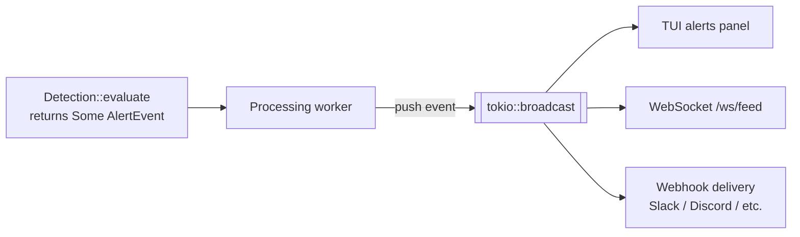

# Detections

The three Phase 1 security rules: what they fire on, why protocol teams care, and how to configure them.

If you remember one sentence: **detections are pattern matches over a typed `Vec<ParsedInstruction>`. They don't decode bytes, they just check labels.** See [`classification.md`](classification.md) for how the labels are produced.

## The plug-in shape

Every detection implements one tiny trait, defined in `crates/gulfwatch-core/src/detections/mod.rs`:

```rust
pub trait Detection: Send {
    fn name(&self) -> &str;
    fn evaluate(&mut self, tx: &Transaction) -> Option<AlertEvent>;
}
```

That's the entire contract. The processing worker holds a `Vec<Box<dyn Detection>>` and calls `evaluate` on every monitored transaction. Returning `Some(AlertEvent)` fires an alert; returning `None` is a quiet pass. Detections can hold mutable state (`&mut self`) because the worker is single-task: no locks, no contention.

Detections are registered in the binary's `main.rs`:

```rust
let detections: Vec<Box<dyn Detection>> = vec![
    Box::new(AuthorityChangeDetection),
    Box::new(FailedTxClusterDetection::default()),
    Box::new(LargeTransferDetection::new(watched_accounts, threshold)),
];
```

Adding a fourth detection is one new file plus one line in this list.

## The alert flow

When a detection returns `Some(AlertEvent)`, here's what happens:



The worker pushes the event into a `tokio::broadcast` channel. Every connected consumer (the TUI's alert panel, WebSocket clients connected to `/ws/feed`, the webhook delivery task) receives the event within milliseconds. A protocol team's Slack channel sees the alert about a second after the on-chain event.

The `AlertEvent` shape (defined in `crates/gulfwatch-core/src/alert.rs`):

```rust
pub struct AlertEvent {
    pub rule_id: String,
    pub rule_name: String,
    pub program_id: String,
    pub metric: String,
    pub value: f64,
    pub threshold: f64,
    pub fired_at: DateTime<Utc>,
}
```

This shape was designed for the rolling-window threshold engine first, so the security detections stuff their structured data into `metric` (e.g. `"raydium_USDC_vault → exit_wallet"`) and use `value` / `threshold` for amounts. A future refactor will likely make this an enum with security-specific variants.

---

## 1. Authority Change Detection

**What it fires on:** any SPL Token `SetAuthority` instruction OR any BPF Loader Upgradeable `Upgrade` instruction touching a monitored program.

**Why it matters:** these are the loudest red flags in the Solana exploit playbook. Attackers change authority on a token mint to mint themselves infinite supply, or they upgrade a program to inject backdoor code, *before* they actually drain funds. Catching these gives a protocol team minutes (sometimes hours) of warning before the actual loss happens. Wormhole's attacker famously changed signer authority before draining $320M.

### Fires when

- The transaction contains an `InstructionKind::SetAuthority`, **OR**
- The transaction contains an `InstructionKind::Upgrade`

That's it. Stateless. One match → one alert.

### How it works

```rust
let trigger = tx.instructions.iter().find_map(|ix| match ix.kind {
    InstructionKind::SetAuthority => Some("set_authority"),
    InstructionKind::Upgrade => Some("upgrade"),
    _ => None,
})?;
```

The detection scans `tx.instructions`, picks the first matching variant via `find_map`, and constructs an `AlertEvent`. A transaction with both a SetAuthority *and* an Upgrade still fires exactly one alert (the first match wins). The detection doesn't care whether the instruction is top-level or inside a CPI; both are in `tx.instructions` because [`extract_all_instructions`](classification.md#inner-instructions-are-where-the-action-is) walks both.

### Configuration

None. Runs whenever it's registered in the worker. No env vars, no tuning knobs.

### Alert payload

| Field | Value |
|---|---|
| `rule_name` | `"Authority change detected"` |
| `metric` | `"set_authority"` or `"upgrade"` (whichever fired) |
| `value` | `1.0` (placeholder; this detection is binary) |
| `threshold` | `0.0` |
| `rule_id` | `"authority_change:<tx_signature>"` |

### What it doesn't catch (yet)

- **BPF Loader Upgradeable's own `SetAuthority` (tag 4) and `SetAuthorityChecked` (tag 7).** These change a program's *upgrade authority*, also security-relevant. Currently classified as `Other { name: "loader_ix_4" }` because the parser doesn't decode them. One match arm in `classify_bpf_loader_upgradeable` to fix.
- **Token-2022 (`TokenzQdBNbLqP5VEhdkAS6EPFLC1PHnBqCXEpPxuEb`).** Same instruction layouts as classic SPL Token, just a different program ID. One constant in the parser to fix.
- **Multisig authority changes.** A SetAuthority against a multisig-owned account fires the same alert as one against a single-key account; the detection doesn't distinguish.

### File

`crates/gulfwatch-core/src/detections/authority_change.rs` (7 unit tests)

---

## 2. Failed Transaction Cluster Detection

**What it fires on:** when a single signer produces enough failed transactions inside a sliding time window and then a successful one. The success right after a burst of failures is the moment they cracked an exploit.

**Why it matters:** this is the classic attacker-probing pattern. Smart-contract exploits don't usually land on the first try; the attacker tweaks inputs (different account orderings, different amounts, slightly different instructions) until one combination passes the program's validation logic. From the chain's perspective it looks like one wallet sending wave after wave of failed transactions, then one that finally succeeds. Mango Markets, the Wormhole signature-verification bypass, half the historical Curve exploits: all preceded by exactly this footprint. Catching the success-after-burst gives an alert in the seconds between *"they found the bug"* and *"they actually drain the protocol."*

### Fires when

- A successful transaction arrives, AND
- That transaction's signer (`tx.accounts[0]`, by Solana convention) has at least `failure_threshold` failed transactions stored in the per-signer queue, AND
- All of those failures are within the last `window_secs` seconds (older entries are evicted before the check)

Defaults: **10 failures within 60 seconds → fire on the next success.**

### How it works

State: `HashMap<String /* signer */, VecDeque<DateTime<Utc>>>`. Only **failures** are stored; successes are the trigger event, evaluated against the queue and then dropped (never inserted).

On every transaction:

1. Look up the signer = `tx.accounts[0]`. If the tx has no accounts, return `None` (don't panic).
2. Evict entries from the front of the signer's queue while they're older than `tx.timestamp - window`. If the queue becomes empty, remove the signer from the map. (This is what keeps the HashMap bounded under signer churn.)
3. If `tx.success == false` → push `tx.timestamp` onto the signer's queue, return `None`.
4. If `tx.success == true` → check the queue length. If it's `>= failure_threshold`, fire an `AlertEvent` and **clear the signer's queue** so the next routine success doesn't re-fire.

The queue clear in step 4 is the dedup mechanism. After alerting, the attacker would need to build up another full cluster of failures before a second alert fires. No separate cooldown state needed.

### Configuration

Constructed with `FailedTxClusterDetection::default()`, **10 failures within 60 seconds**. To tune, either edit the `Default` impl in `crates/gulfwatch-core/src/detections/failed_tx_cluster.rs`, or call `FailedTxClusterDetection::new(threshold, window_secs)` directly in the binary's `main.rs`.

### Alert payload

| Field | Value |
|---|---|
| `rule_name` | `"Failed transaction cluster detected"` |
| `metric` | `"failed_tx_cluster"` |
| `value` | The failure count that triggered the fire (e.g. `10.0`) |
| `threshold` | The configured threshold (e.g. `10.0`) |
| `rule_id` | `"failed_tx_cluster:<signer>:<tx_signature>"` |

### What it doesn't catch

- **Distributed probing across multiple signers.** A sophisticated attacker who rotates wallets between failed attempts looks like 10 different signers with 1 failure each; none of which fires the rule. Detecting that requires correlation logic (e.g. clustering signers that all touch the same target account), which is post-Phase-1.
- **Failures spaced wider than `window_secs` apart.** A patient attacker who probes once per minute over an hour would never trip the threshold because each failure ages out before the next one is recorded. Tunable via `window_secs`, but there's a real trade-off between catching slow-burn attacks and producing false positives from legitimate retry behavior.
- **Failure-only patterns.** If the attacker never lands a success, this detection never fires. That's deliberate: alerting on every burst of failures with no resolution would generate noise during chain congestion. A separate "high failure rate" alert can be added on top of the existing rolling-window `AlertEngine`.

### File

`crates/gulfwatch-core/src/detections/failed_tx_cluster.rs` (9 unit tests)

---

## 3. Large Transfer Anomaly Detection

**What it fires on:** an SPL Token `Transfer` or `TransferChecked` that moves an amount at or above a configurable threshold *out of* an account in the operator's watch list. This is the "drain in progress" signal.

**Why it matters:** the previous two detections are pre-attack; they catch the setup. This one catches the actual loss event. When tokens are leaving a protocol's vault at an unusual rate, the operator wants to know **right now**, not five minutes later. A protocol team that sees this alert can pause their program (if they have an admin key), revoke approvals, or contact CEXes to freeze the destination wallet. Every second between the on-chain event and the alert is a second the response window shrinks.

### Fires when

- The transaction contains an `InstructionKind::TokenTransfer { amount }` OR `InstructionKind::TokenTransferChecked { amount, .. }`
- The instruction's source account (the first entry in `instruction.accounts`, by SPL Token convention) is in `WATCHED_ACCOUNTS`
- `amount >= threshold_amount`

The detection short-circuits to inert if either `WATCHED_ACCOUNTS` is empty OR `LARGE_TRANSFER_THRESHOLD` is unset. A default `.env` with no Feature 3 config makes this detection a silent no-op rather than a noise generator.

### How it works

For each instruction in `tx.instructions`:

```rust
let amount = match ix.kind {
    InstructionKind::TokenTransfer { amount } => amount,
    InstructionKind::TokenTransferChecked { amount, .. } => amount,
    _ => continue,
};
if amount < self.threshold_amount { continue; }
let source = ix.accounts.first()?;
if !self.watched_accounts.contains(source) { continue; }
// → fire alert
```

The detection fires on the first matching instruction (early return). A transaction with multiple watched-source large transfers fires once and the operator drills down via the tx signature in the alert. This trade-off keeps alert volume sane during high-traffic events.

**One non-obvious bit:** the destination account index differs between the two transfer instructions:

- `Transfer` accounts: `[source, destination, owner]` → destination is at index `1`
- `TransferChecked` accounts: `[source, mint, destination, owner]` → destination is at index `2` (because the mint sits in between)

The `destination_of` helper handles this. The unit tests assert it works for both variants.

### Configuration

| Env var | Type | What it does |
|---|---|---|
| `WATCHED_ACCOUNTS` | comma-separated strings | The set of SPL token account addresses to watch transfers *from*. Empty (or unset) → detection is inert. |
| `LARGE_TRANSFER_THRESHOLD` | `u64` (raw token units) | Minimum transfer amount that fires. Unset → detection is inert. |

**Important:** the threshold is in **raw token units** (smallest denomination), not human units. To threshold on 10 SOL, set `LARGE_TRANSFER_THRESHOLD=10000000000` (because SOL has 9 decimals). To threshold on 10,000 USDC, set it to `10000000000` (because USDC has 6 decimals: 10_000 × 10⁶ = 10¹⁰). The threshold is global across all watched accounts; if you watch both a SOL vault and a USDC vault with the same threshold, it'll fire on whichever transfer hits the number first.

For finding real vault addresses to populate `WATCHED_ACCOUNTS`, look up the protocol's pool on Solscan and copy the `baseVault` and `quoteVault` fields. For Raydium SOL/USDC, those are real, public, stable addresses you can find in seconds.

### Alert payload

| Field | Value |
|---|---|
| `rule_name` | `"Large transfer from watched account"` |
| `metric` | `"<source_address> → <destination_address>"` (the flow) |
| `value` | The transfer amount in raw token units |
| `threshold` | The configured `LARGE_TRANSFER_THRESHOLD` |
| `rule_id` | `"large_transfer:<source>:<tx_signature>"` |

### What it doesn't catch

- **Transfers from accounts not in the watch list.** If the operator forgets to add a vault to `WATCHED_ACCOUNTS`, transfers out of it are invisible to this detection. A future Option B (auto-discover via `getProgramAccounts`) would solve this, at the cost of a heavier startup query. Tracked in the configuration plan as "Phase 2 ergonomics."
- **Mass small transfers.** An attacker who drains via 10,000 transfers of 0.001 SOL each will never trip a per-instruction threshold. Catching that requires aggregation over a time window. That's a separate detection, not a tweak to this one.
- **Multiple transfers in one tx.** Only the first matching transfer fires. Operator interprets context from the signature.
- **USD-denominated thresholds.** No FX conversion; the operator is responsible for picking sensible raw-unit thresholds for the tokens their watched accounts hold. Mixing volatile and stable assets in one config requires care.

### File

`crates/gulfwatch-core/src/detections/large_transfer.rs` (10 unit tests)

---

## Configuration cheat sheet

All env vars relevant to detections, in one place:

| Variable | Detection | Required? | Default | Purpose |
|---|---|---|---|---|
| *(none)* | Authority Change | n/a | n/a | Always on when registered |
| *(none)* | Failed Tx Cluster | n/a | 10 / 60s | Tune via `FailedTxClusterDetection::new(threshold, window_secs)` in code |
| `WATCHED_ACCOUNTS` | Large Transfer | yes for fire | empty (inert) | Comma-separated SPL token accounts to watch |
| `LARGE_TRANSFER_THRESHOLD` | Large Transfer | yes for fire | `u64::MAX` (inert) | Min raw token units that fire the alert |

If `WATCHED_ACCOUNTS` is unset OR `LARGE_TRANSFER_THRESHOLD` is unset, the Large Transfer detection is silently inert. The other two are always on.

## Adding a new detection

Same recipe for any detection you want to add.

**1. Create a new file** in `crates/gulfwatch-core/src/detections/`, e.g. `oracle_deviation.rs`.

**2. Define a struct** that holds whatever state your rule needs (or none, for stateless rules):

```rust
pub struct OracleDeviationDetection {
    max_deviation_pct: f64,
    last_seen_prices: HashMap<String, f64>,
}
```

**3. Implement `Detection`** with `name()` and `evaluate()`. Pattern-match on `tx.instructions` for whatever your rule cares about. Return `Some(AlertEvent)` to fire.

**4. Re-export** from `crates/gulfwatch-core/src/detections/mod.rs` and `crates/gulfwatch-core/src/lib.rs`.

**5. Register** in `crates/gulfwatch-server/src/main.rs` AND `crates/gulfwatch-tui/src/main.rs` by appending to the `detections` vec.

**6. Write tests** mirroring the existing detection test files. At minimum: a positive case that fires, a negative case that doesn't, and a no-panic test for malformed input.

That's it. Zero changes to the worker, the alert engine, or the broadcast channel.

## What's not implemented yet

These are the detections on the roadmap but explicitly out of Phase 1. Each is one new file under `detections/`, no infrastructure changes needed.

- **Oracle price deviation.** Fires when an oracle update moves a price by more than `max_deviation_pct` from the last seen value. Requires integrating an oracle program (Pyth, Switchboard) into the parser.
- **Flash loan pattern.** Fires when a transaction borrows and repays from the same lending program within a single tx (CPI depth analysis).
- **Abnormal mint.** Fires when `MintTo` instructions issue tokens without a corresponding deposit elsewhere in the same tx. Catches infinite-mint exploits.
- **Cross-program invocation anomalies.** Fires when a tx triggers an unusually deep CPI chain or hits programs that wouldn't normally be invoked together.
- **Historical baselines.** Adapts thresholds to a program's normal activity levels instead of operator-set static values. Requires the persistence layer that Phase 1 deliberately avoids.

## File map

| Detection | File | Tests |
|---|---|---|
| Authority Change | `crates/gulfwatch-core/src/detections/authority_change.rs` | 7 |
| Failed Tx Cluster | `crates/gulfwatch-core/src/detections/failed_tx_cluster.rs` | 9 |
| Large Transfer | `crates/gulfwatch-core/src/detections/large_transfer.rs` | 10 |
| Cross-Program Correlation | `crates/gulfwatch-core/src/detections/correlation.rs` | 15 |
| `Detection` trait + module exports | `crates/gulfwatch-core/src/detections/mod.rs` | 2 |
| Worker that runs all detections | `crates/gulfwatch-core/src/pipeline.rs` | 2 |
| Server registration | `crates/gulfwatch-server/src/main.rs` | n/a |
| TUI registration | `crates/gulfwatch-tui/src/main.rs` | n/a |

## What's not in this document

- **How transactions get classified into the typed enum the detections read** → see [`classification.md`](classification.md)
- **The high-level architecture and component layout** → see [`architecture.md`](architecture.md)
- **REST + WebSocket API for consuming alerts from outside the binaries** → see the [root README](../README.md)
